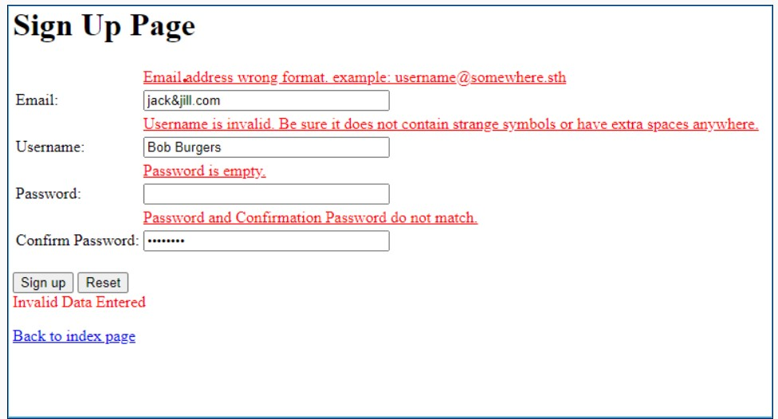

# [Exercise 3 : Form](https://www.cs.uregina.ca/Links/class-info/215/dom2/index.html)
### Details:
- Create a folder for Lab6
- In that folder, create an HTML page with a signup form signup.html. Add all support .css and .js files for lab 6 to this folder only.
- You may use the sample code from the link above. Check the TODO: comments carefully in all files if you do.
- If you have CSS styling, please use an external CSS file.
- You will use two external JavaScript files, signup_r.js to register submit and reset events using DOM2 event registration, and validate.js to validate and reset the form.
- When the SignUp button is clicked, a submit event will be triggered. Your SignUpForm() function must handle the event and provide proper feedback to the user using DOM manipulation.
- Red text should appear above the field(s) if they have invalid format, are too long or are empty - you are adding regular expression validation to the Lab 5 rules.
- You should use DOM Operations as much as possible. Use innerHTML only for small changes. See the sample code for an example of what to do.
The following is an example showing some invalid input messages in red text.

 

